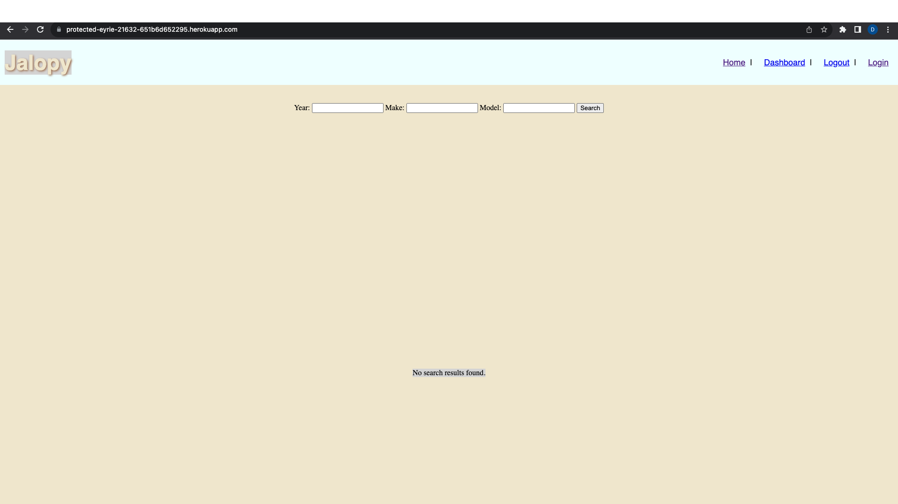

# jalopy-blog

## Table of Contents
1. [About The Project](#about-the-project)
2. [Installation](#installation)
3. [Usage](#usage)
4. [Acknowledgments](#acknowledgments)

<!-- ABOUT THE PROJECT -->
## About The Project

**Description** - A blog for automobile owners to express their opinions about the car of their choice. The years range from 2000 to 2023. This program has the most popular makes and models from the year range mentioned above.

**Motivation for development** - Users today are left to either skim Reddit threads or read professional reviews. This website allows common people to find each other’s reviews.

([back to top](#readme-top))

### Installation
1. Clone the repo from [Github](https://github.com/Daleray1231/Jalopy_Blog)  to your local device.

2. Run cmd:   
``npm install``  
  
3. create .env file and verify sql credentials  
  
4. run cmd:   
``mysql -u root -p``;   
enter password  
  
5. run cmd:   
            ``use jalopy_db``;  
            ``source (schema file path)``;  
            ``source (seeds file path)``;   
              quit;    
  
6. run cmd: ``npm run start``  

   
<!-- USAGE EXAMPLES -->

## Usage
The Github repository can be found here:  
[Github Repo](https://github.com/Daleray1231/Jalopy_Blog) 

The deployed application can be found here:  
[Deployed Application]()

<!-- ACKNOWLEDGMENTS -->
## Acknowledgments
Tutorials and instruction provided by the University of Texas at Austin Full Stack Web Development Program and its affiliated professors and TA's.